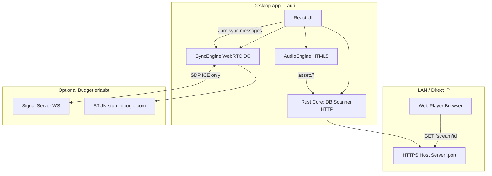

# ArtMusic — Technische Spezifikation (Phase 0 / PoC)

**Version:** 0.1.0  
**Stand:** 2026-05-17  
**Zweck:** Entscheidungsgrundlage für Budget-Freigabe (4-köpfiges TS/React-Team)  
**Status:** Greenfield-Konzept + lauffähiger **Proof-of-Concept** (kein Produktions-MVP)

---

## 1. Executive Summary

ArtMusic ist eine **self-hosted Musik-App** für audiophile Nutzer: Spotify-ähnliche UX, aber **keine zentrale Streaming-Infrastruktur** und **keine Nutzerdaten-Speicherung** auf unseren Servern.

| Bereich | Entscheidung | Begründung |
|---------|--------------|------------|
| Desktop-Client | **Tauri 2** (Rust + WebView) | Team kennt TS/React; Rust nur für I/O, DB, HTTP — kein C++ nötig |
| Lokale Bibliothek | **SQLite + FTS5** | Offline, schnelle Suche, Zero-Config |
| Audio-Wiedergabe (lokal) | **HTML5 `<audio>`** via Tauri Asset Protocol | Ausreichend für MP3/FLAC/M4A im WebView2; kein natives DSP nötig für MVP |
| Teilen im LAN | **HTTPS-Mini-Server** (`tiny_http` + `rustls`) | Direct-IP, kein Relay-Traffic |
| Jam-Sync (PoC) | **WebRTC DataChannel** (nur Steuerung) | Audio läuft weiterhin vom **Host-HTTP-Stream** — kein Audio-over-WebRTC |
| Signalisierung (MVP) | **WebSocket** auf minimalem VPS | Nur SDP/ICE — **kein Audio** |
| NAT-Traversal | STUN (Google, kostenlos) + optional **öffentlicher SSH-Tunnel** | Kein eigener TURN-Server im Budget |

**Wichtig:** Der vorliegende PoC implementiert bereits Bibliothek, Hosting und Web-Player. **P2P-Jam-Sync** ist als Modul (`SyncEngine.ts`) skizziert, aber **noch nicht End-to-End verdrahtet** (kein Signal-Server, keine ICE-Austausch-UI).

---

## 2. Produktziele & Nicht-Ziele

### 2.1 Ziele

- Zero-Configuration: App startet → DB wird angelegt → Nutzer fügt Musik hinzu oder scannt Ordner
- Lossless-fähig: FLAC/WAV werden indexiert und per korrektem `Content-Type` ausgeliefert
- Datenschutz: Keine Telemetrie, keine Cloud-Metadaten-Pflicht; FTS-Index nur lokal
- Deployment ohne CLI: Installer (Tauri Bundle), Hosting per einem Klick

### 2.2 Nicht-Ziele (Phase 0 / MVP v1)

- Kein Spotify-ähnlicher Musik-Katalog aus dem Internet
- Kein Audio-Streaming über zentralen Signal-Server
- Kein proprietärer TURN-Cluster (Budget)
- Kein echtes Audio-P2P (WebRTC Media) — bewusst ausgeschlossen wegen Komplexität und Codec-Latenz

---

## 3. Systemarchitektur



### 3.1 Datenfluss Audio (implementiert)

1. Host startet `start_hosting_server(port)` → Rust bindet:
   - `https://{LAN-IP}:{port}` (TLS, selbstsignierte CA)
   - `http://127.0.0.1:{port}` (Loopback für SSH-Tunnel)
2. Client-Browser lädt `GET /` → eingebettetes `web_player.html`
3. Wiedergabe: `GET /stream/{track_id}` → Datei vom Host-Dateisystem
4. **Kein** Audio durch Signal-Server oder P2P-DataChannel

### 3.2 Datenfluss Jam-Sync (spezifiziert, PoC teilweise)

1. Host und Client tauschen **SDP + ICE** über Signal-Server (WebSocket)
2. `RTCPeerConnection` mit `iceServers: [{ urls: 'stun:stun.l.google.com:19302' }]`
3. Host erstellt DataChannel `jam-sync` (`ordered: false`, `maxRetransmits: 0`)
4. Nur JSON-Nachrichten (Ping/Pong, Playback-Sync) — siehe §6

---

## 4. Technologie-Stack (Ist-Zustand PoC)

| Schicht | Technologie | Version (PoC) |
|---------|-------------|---------------|
| UI | React + TypeScript + Vite | React 19, Vite 7 |
| State | Zustand | 5.x |
| Desktop | Tauri | 2.x |
| Backend | Rust (`tokio` implizit via Tauri) | edition 2021 |
| DB | rusqlite + FTS5 | 0.31 |
| Metadaten | lofty | 0.19 |
| HTTP(S) | tiny_http + rustls | 0.12 |
| TLS-Zertifikate | rcgen | 0.13 |
| Tunnel (optional) | OpenSSH → localhost.run | System-SSH |

---

## 5. Lokale Datenhaltung

### 5.1 Speicherort

- Windows: `%APPDATA%\com.artmusic.desktop\artmusic_library.db`
- Zusätzlich: `ca.crt`, `ca.key` (einmalig generierte Root-CA für LAN-TLS)

### 5.2 SQLite-Schema

```sql
-- Kern
CREATE TABLE tracks (
  id TEXT PRIMARY KEY,
  server_id TEXT NOT NULL,
  title TEXT NOT NULL,
  artist TEXT NOT NULL,
  album TEXT NOT NULL,
  duration_ms INTEGER NOT NULL,
  codec TEXT NOT NULL,
  is_lossless BOOLEAN NOT NULL,
  source TEXT NOT NULL,
  file_path_or_id TEXT NOT NULL,
  cover_path TEXT
);
CREATE UNIQUE INDEX idx_tracks_file_path ON tracks(file_path_or_id);

CREATE TABLE releases (
  id TEXT PRIMARY KEY,
  title TEXT NOT NULL,
  artist TEXT NOT NULL,
  type TEXT NOT NULL,          -- album | single | ep
  cover_gradient TEXT NOT NULL,
  cover_path TEXT
);

CREATE TABLE release_tracks (
  release_id TEXT NOT NULL,
  track_id TEXT NOT NULL,
  PRIMARY KEY (release_id, track_id),
  FOREIGN KEY (release_id) REFERENCES releases(id) ON DELETE CASCADE,
  FOREIGN KEY (track_id) REFERENCES tracks(id) ON DELETE CASCADE
);

-- Volltextsuche
CREATE VIRTUAL TABLE tracks_fts USING fts5(
  title, artist, album,
  content='tracks', content_rowid='rowid'
);
-- Trigger tracks_ai, tracks_ad, tracks_au (siehe db.rs)
```

### 5.3 Tauri Commands (IPC)

| Command | Parameter | Rückgabe | Beschreibung |
|---------|-----------|----------|--------------|
| `search_tracks` | `query: string` | `TrackSearchResult[]` | FTS5 Prefix-Suche (`query*`) |
| `scan_directory` | `path: string` | `number` | Rekursiv MP3/FLAC/WAV/M4A indexieren |
| `get_default_music_dir` | — | `string \| null` | OS-Standard-Musikordner |
| `add_track_to_db` | Metadaten + Pfade | `track_id` | Manueller Track |
| `get_all_tracks` | — | `TrackInfo[]` | Bibliothek |
| `add_release_to_db` | Release + `trackIds[]` | `release_id` | Album/Single/EP |
| `get_all_releases` | — | `ReleaseInfo[]` | Inkl. Trackliste |
| `start_hosting_server` | `port: number` | `string` | Startet HTTP(S)-Server |
| `stop_hosting_server` | — | `string` | Stoppt Server + Tunnel |
| `get_hosting_status` | — | `HostingInfo` | Status, IP, Port, Tunnel-URL |
| `get_local_ip` | — | `string \| null` | UDP-Trick via 8.8.8.8 |
| `start_public_tunnel` | `port: number` | `tunnel_url` | SSH -R zu localhost.run |
| `stop_public_tunnel` | — | `string` | Beendet SSH-Child |

---

## 6. Hosting-API (HTTP)

Basis-URL: `https://{LAN-IP}:{port}` oder Tunnel-URL (HTTPS, öffentlich gültiges Zertifikat via localhost.run).

| Methode | Pfad | Response | Hinweis |
|---------|------|----------|---------|
| `GET` | `/` | `text/html` | Eingebetteter Web-Player |
| `GET` | `/ca.crt` | `application/x-x509-ca-cert` | Root-CA für LAN-Vertrauen |
| `GET` | `/api/tracks` | JSON `HostTrack[]` | Öffentlicher Katalog |
| `GET` | `/api/releases` | JSON `HostRelease[]` | Releases inkl. Tracks |
| `GET` | `/stream/{track_id}` | Audio-Bytes | `Content-Type` nach Extension; **Range: bytes** unterstützt |
| `GET` | `/cover/{track_id}` | JPEG/PNG | Aus `cover_path` |
| `GET` | `/cover/release/{release_id}` | JPEG/PNG | Release-Cover |
| `OPTIONS` | `*` | 200 + CORS | Preflight |

### 6.1 JSON: HostTrack

```json
{
  "id": "uuid",
  "title": "string",
  "artist": "string",
  "album": "string",
  "duration_ms": 240000,
  "cover_path": "C:\\optional\\cover.jpg"
}
```

### 6.2 HTTP Range (Seeking)

Request:

```http
GET /stream/{id} HTTP/1.1
Range: bytes=1024-2047
```

Response `206 Partial Content`:

```http
Content-Range: bytes 1024-2047/5242880
Content-Length: 1024
Accept-Ranges: bytes
```

Ohne Range-Header: `200` mit vollständiger Datei.

---

## 7. Jam-Synchronisation (WebRTC DataChannel)

### 7.1 Scope

| Was | Transport | Status PoC |
|-----|-----------|------------|
| Play/Pause/Seek-Zeit | DataChannel `jam-sync` | Modul vorhanden, **nicht verdrahtet** |
| Audio-Stream | HTTP vom Host | **Implementiert** |
| Freundesliste / Sessions | — | **UI-Placeholder** (keine echten Daten) |

### 7.2 Signal-Server (MVP — zu bauen)

- **Protokoll:** WebSocket (`wss://signal.artmusic.example/ws`)
- **Auth:** Einmal-Token pro Session (lokal generiert, nicht persistent auf Server)
- **Server speichert:** Nichts nach Disconnect (nur In-Memory-Relay)

#### Nachrichten (JSON, Text-Frame)

**Client → Server:**

```json
{ "v": 1, "type": "join", "roomId": "jam-abc123", "peerId": "uuid-local" }
{ "v": 1, "type": "signal", "roomId": "jam-abc123", "to": "uuid-remote", "payload": { "sdp": "...", "type": "offer" } }
{ "v": 1, "type": "signal", "roomId": "jam-abc123", "to": "uuid-remote", "payload": { "candidate": "...", "sdpMLineIndex": 0 } }
```

**Server → Client:** gleiche Struktur, `to` = Empfänger.

### 7.3 DataChannel: `jam-sync`

- **Label:** `jam-sync`
- **Optionen:** `{ ordered: false, maxRetransmits: 0 }` (niedrige Latenz, verlusttolerant)
- **Serialisierung:** UTF-8 JSON, eine Nachricht pro Frame

#### 7.3.1 Clock-Sync (NTP-ähnlich)

**Client → Host (Ping):**

```json
{ "type": "ping", "t0": 1715952000000 }
```

**Host → Client (Pong):**

```json
{ "type": "pong", "t0": 1715952000000, "t1": 1715952000012, "t2": 1715952000013 }
```

**Client berechnet** (bei Empfang `t3 = Date.now()`):

```
rtt = (t3 - t0) - (t2 - t1)
clockOffset = ((t1 - t0) + (t2 - t3)) / 2
```

Intervall: alle **5 s** solange Jam aktiv.

#### 7.3.2 Playback-Sync

**Host → alle Clients:**

```json
{
  "type": "playback-sync",
  "status": "playing",
  "positionMs": 15400,
  "hostTimestamp": 1715952005000
}
```

**Client-Algorithmus** (`SyncEngine.handlePlaybackSync`):

```
calculatedHostTime = Date.now() + clockOffset
latencyCorrection = calculatedHostTime - msg.hostTimestamp
targetPositionMs = msg.positionMs + latencyCorrection
```

Wenn `|currentTime - targetPositionMs| > 50` → `audio.currentTime` setzen.  
Event an UI: `CustomEvent('jam-sync-update', { detail: { status, targetPositionMs } })`.

### 7.4 State-Machine (Zustand Store — Ziel MVP)

```typescript
type JamPhase = 'idle' | 'signaling' | 'connected' | 'syncing' | 'error';

interface JamState {
  phase: JamPhase;
  roomId: string | null;
  isHost: boolean;
  peerConnection: RTCPeerConnection | null;
  clockOffsetMs: number;
  rttMs: number;
  lastPlayback: { status: 'playing' | 'paused'; positionMs: number } | null;
}
```

**Übergänge:**

- `idle` → `signaling`: User „Join Jam“ / „Host Jam“
- `signaling` → `connected`: `iceConnectionState === 'connected'`
- `connected` → `syncing`: DataChannel `open` + erster Pong empfangen
- `*` → `error`: `failed` / Timeout 30 s ohne Pong

---

## 8. Frontend-State (Zustand)

### 8.1 `useAppStore`

| Feld | Typ | Beschreibung |
|------|-----|--------------|
| `customTracks` | `Track[]` | Aus SQLite |
| `customReleases` | `Release[]` | Aus SQLite |
| `currentTrack` | `Track \| null` | Player |
| `isPlaying` | `boolean` | Play/Pause |
| `isHosting` | `boolean` | Server aktiv |
| `hostingIP` / `hostingPort` | | LAN-Zugang |
| `tunnelURL` | `string` | localhost.run |

### 8.2 `useJamStore` (MVP)

Aktuell **leer** — keine Mock-Freunde. Freundesliste kommt später via optionaler **mDNS-Discovery** oder manueller Invite-URL (`artmusic://jam/{roomId}`).

---

## 9. Zero-Configuration & Deployment

### 9.1 Erststart

1. Tauri `setup` → `initialize_database(app_data_dir)`
2. Keine Account-Erstellung
3. Optional: `scan_directory(get_default_music_dir())`

### 9.2 Hosting aktivieren

1. User klickt „Boot Sharing Server“ → Port default **8088**
2. UI zeigt `https://{LAN-IP}:8088`
3. **Option A (LAN):** Root-CA `/ca.crt` auf Client-Gerät installieren (einmalig)
4. **Option B (Internet):** „Tunnel starten“ → OpenSSH Reverse zu **localhost.run** (Drittanbieter, kostenlos, **kein** eigener Server)

### 9.3 Installer

- `tauri build` → MSI/NSIS (Windows), `.dmg` (macOS), `.deb`/AppImage (Linux)
- Auto-Update: Phase 2 (Tauri Updater + signierte Releases)

### 9.4 Bekannte Deployment-Risiken

| Risiko | Mitigation |
|--------|------------|
| Browser blockiert selbstsigniertes TLS | CA-Install-Anleitung in UI; Tunnel Option B |
| Doppel-NAT / CGNAT | SSH-Tunnel oder später minimaler TURN nur für Signal, nicht Audio |
| Windows Firewall | Beim ersten Start Windows-Firewall-Regel anbieten (Tauri Plugin Phase 2) |
| OpenSSH fehlt (Windows) | Klare Fehlermeldung + Link zu „Optional Features“ |

---

## 10. Recht & Datenschutz

- **Keine** Nutzerdaten auf Infrastruktur des Herstellers (Signal-Server: nur ephemeral Relay)
- **Keine** Telemetrie im Default-Build (`TAURI_ANALYTICS` deaktiviert)
- Metadaten aus ID3/Vorbis/APIC — Verarbeitung **nur lokal**
- Tunnel localhost.run: Nutzer informieren, dass Audio temporär über Drittanbieter geroutet wird (HTTPS zu deren Edge)

---

## 11. Performance & Lossless

| Format | Lokale Wiedergabe (WebView2) | HTTP-Stream |
|--------|------------------------------|-------------|
| MP3 | Ja | Ja |
| FLAC | Ja (Chromium) | Ja (`audio/flac`) |
| WAV | Ja | Ja (`audio/wav`) |
| M4A/AAC | Ja | Ja (`audio/mp4`) |

**Hinweis:** Gapless, Bit-Perfect und sehr große FLAC-Dateien können im WebView von Plattform-Codecs abhängen. Für audiophile „Bit-Perfect“-Garantie ist Phase 3 ein natives Audio-Backend (z. B. `cpal` + `rodio`) vorgesehen — **nicht** Phase 0.

---

## 12. Team-Roadmap (4 Entwickler, Vorschlag)

| Sprint | Dauer | Deliverables |
|--------|-------|--------------|
| **S1 PoC härten** | 2 Wo | Range-Requests, CA-Fix, MIME, keine Mock-Daten, Build CI |
| **S2 Signal + Jam E2E** | 3 Wo | WebSocket-Signal-Server (Node), Join/Host UI, SyncEngine verdrahtet |
| **S3 UX Polish** | 2 Wo | Ordner-Dialog, Firewall-Hinweis, Installer, Web-Player Parität |
| **S4 Beta** | 3 Wo | mDNS optional, Fehlerbehandlung, Dokumentation |

**Kritischer Pfad:** Signal-Server + WebRTC-Handshake — ohne diesen ist Jam-Sync nicht testbar.

---

## 13. Machbarkeitsurteil (Stakeholder-Fragen)

### „Ist P2P-Sync technisch machbar?“

**Ja, für Playback-Steuerung** (<50 ms Drift-Korrektur) mit WebRTC DataChannel + NTP-Algorithmus. **Audio bleibt beim Host** (HTTP) — das reduziert Risiko und Kosten massiv und entspricht dem Budget.

### „Deployment ohne User-Frust?“

**LAN:** machbar mit CA-Install (einmalig) oder Tunnel.  
**Internet ohne CA:** localhost.run-Tunnel funktioniert out-of-the-box, ist aber Drittanbieter-abhängig.  
Langfristig: eigene Domain + Let’s Encrypt nur für **Signal**-Subdomain, nicht für Audio-Traffic.

---

## 14. Abgrenzung PoC vs. Spezifikation

| Feature | PoC-Code | Diese Spec |
|---------|----------|------------|
| SQLite + FTS | ✅ | ✅ |
| LAN HTTPS Server | ✅ | ✅ |
| Web Player | ✅ | ✅ |
| SSH Tunnel | ✅ | ✅ |
| SyncEngine | ⚠️ Modul only | ✅ vollständig |
| Signal Server | ❌ | ✅ spezifiziert |
| Echte Jam-UI | ❌ Placeholder | ✅ spezifiziert |
| mDNS Freunde | ❌ | Optional MVP+ |

---

## 15. Referenzen im Repository

| Pfad | Inhalt |
|------|--------|
| `src-tauri/src/db.rs` | Schema + FTS-Trigger |
| `src-tauri/src/server.rs` | HTTP(S)-Hosting |
| `src-tauri/src/scanner.rs` | Metadaten-Indexer |
| `src/lib/SyncEngine.ts` | WebRTC-Sync |
| `src/lib/AudioEngine.ts` | HTML5-Playback |
| `src/store/useAppStore.ts` | App-State |

---

*Dieses Dokument beschreibt den **Ist-Stand des PoC** und die **verbindliche Ziel-Architektur** für MVP v1. Empfehlungen ohne Implementierungsnachweis sind als „geplant“ markiert.*
